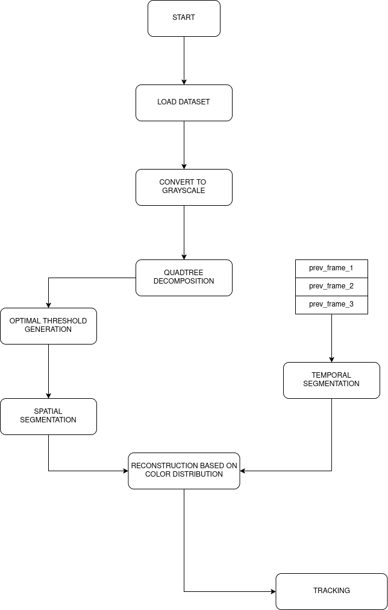

# Hybrid Object Tracking with Rough Entropy

This project implements a hybrid object tracking pipeline that integrates Rough Entropy concepts with traditional change detection methods for improved accuracy in satellite image sequences. Project utilizes data from [Change Detection 2014 dataset](https://www.kaggle.com/code/kerneler/starter-change-detection-2014-042f59d1-1/input).

## 📁 Dataset

We use the **Change Detection 2014** dataset which contains before-and-after satellite imagery, ideal for evaluating change and movement tracking systems.

- Source: [Kaggle](https://www.kaggle.com/code/kerneler/starter-change-detection-2014-042f59d1-1/input)
- Format: Pairwise image frames (e.g., t0 and t1)
- Labels: Ground truth masks indicating changed regions

## 🚀 Methodology

The pipeline follows a hybrid approach:

## 🧠 Current phase

- Research, learning, finding dataset are done.
- First implementation is done, still needs a lot of improvement and testing.